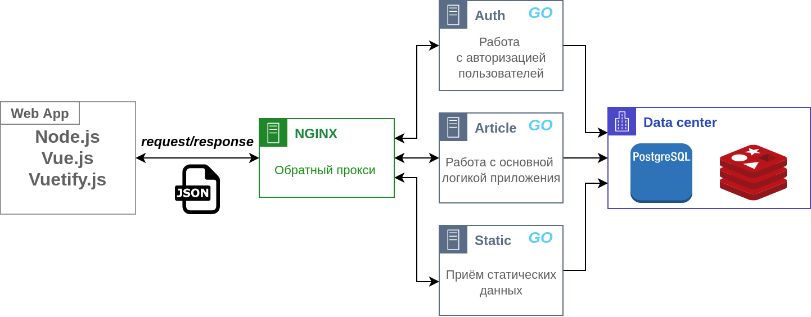
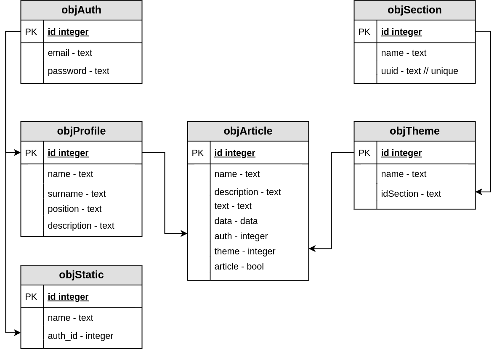
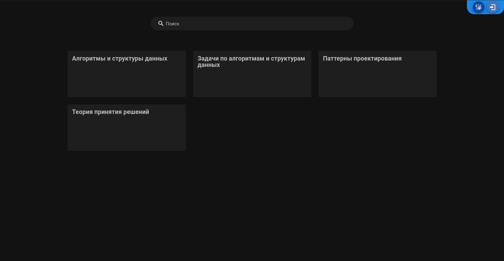
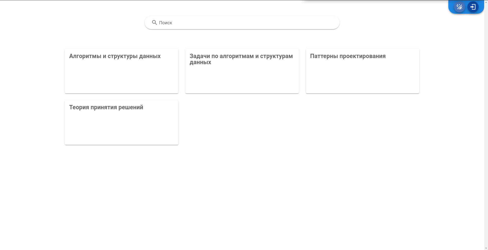
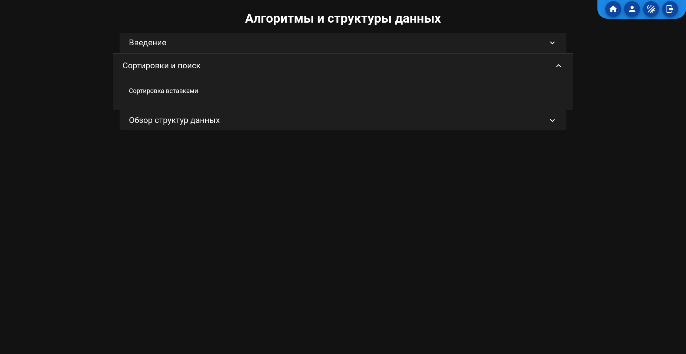
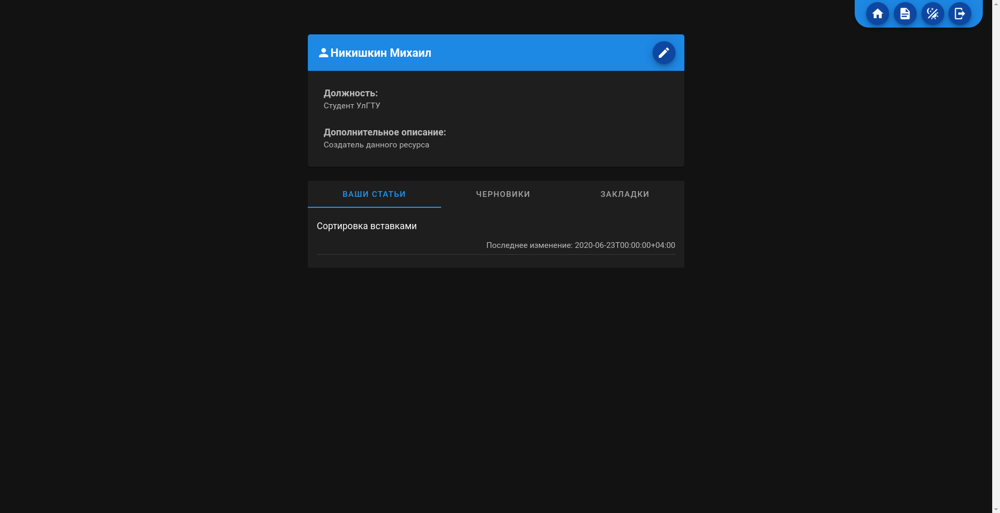
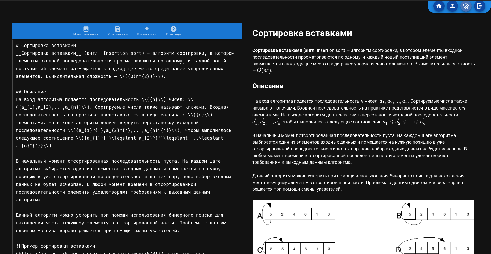
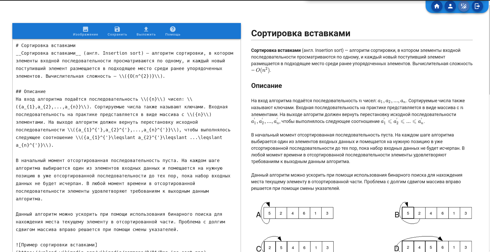

## Библиотека научных статей по информиционным технологиям

Разработчик: Никишкин Михаил ИВТПАбд-21

### Архитектура

Архитектура приложения RESTfullAPI. Есть  веб-приложение написанное на node.js, с использованием фремворков  Vue.js и Vuetify.js. Есть серверная часть разбитая на микросервисы. Для общения веб-приложения и микросервисов используется обратный прокси сервер NGINX, для хранения данных PostgreSQL, для хранения токенов и ключей регистрации Redis.

#### Backend

На данный момент работают два микросервиса. 
+ Сервер регистрации, который отвечает за регистрацию пользователя, отправку подтверждающих сообщений на почту, выдачу пар токенов, обновление токенов, востановление пароля.
+ Сервер обработки основной логики приложения, который отвечает за редактирование данных пользователя, создание и удаление черновиков и статей. 

API сервисов задокументированно
+ [API сервера авторизации](backend/doc/api/auth.md)
+ [API сервера c основной логикой](backend/doc/api/article.md)

#### Frontend

Веб-приложение старается придерживаться правил оформление Google material desing. 

Для создания статей был разработан собственный [markdown интерпритатор](webapp/src/editor/ParseMD.js )

### База данных

### Несколько скриншотов сервиса

__Главная страница:__

### Страница некоторого раздела:

__Страница профиля:__

__Редактор:__

